Introduction
------------

[Rqt\_smach] [rqt] is a Qt based user interface for the robotics state machine  
software [SMACH] [smach]. Rqt\_Smach displays the structure of the [SMACH] [smach]  
state machine, the current state, and user data. In addition, it also  
provides a few different graph display options, a tree view, and the  
ability to set the initial state in a server.   

  [rqt]: https://github.com/jbohren/executive_smach_visualization
  [smach]:   http://wiki.ros.org/smach

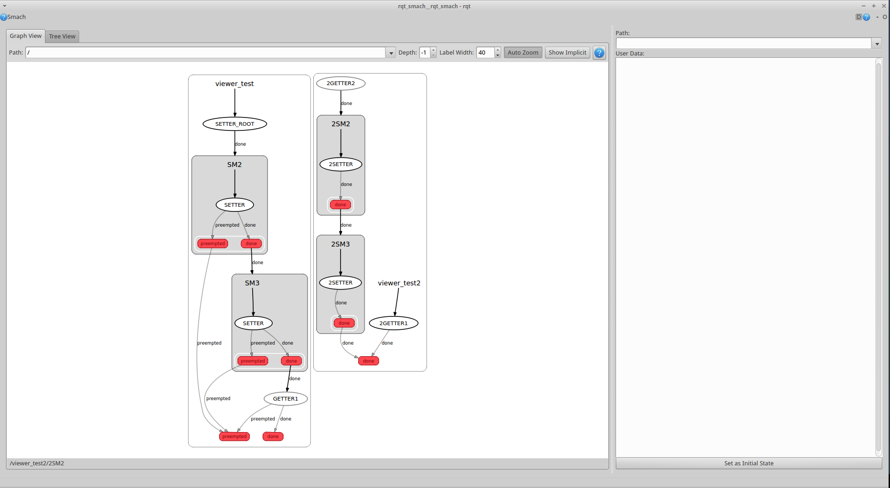

Running Rqt\_Smach
------------------

To run rqt\_smach, you must have [executive\_smach\_visulization] [1], [xdot] [2],  
and [executive\_smach] [3] in your [catkin workspace] [4]. Then build those  
packages using [catkin build] [5] or [catkin\_make] [6].  

  [1]: https://github.com/jbohren/executive_smach_visualization
  [2]: https://github.com/jbohren/xdot
  [3]: https://github.com/jbohren/executive_smach
  [4]: http://wiki.ros.org/catkin/Tutorials/create_a_workspace
  [5]: http://catkin-tools.readthedocs.org/en/latest/verbs/catkin_build.html
  [6]: http://wiki.ros.org/catkin/commands/catkin_make

Once the packages are built, make sure you have a [roscore] [7] running,    
source your environment, and then execute the following command:   

    rosrun rqt_smach rqt_smach

  [7]: http://wiki.ros.org/roscore

The executive\_smach\_viewer package contains two slightly different  
test servers you can use to see how rqt\_smach works. If you open and  
source two new terminals, you can run the tests servers with these  
commands:  

    rosrun smach_viewer test/server.py  

    rosrun smach_viewer test/server2.py  

Features
--------

Rqt\_Smach contains many features to help customize the way the state  
machine is displayed and to provide the user with relevant information.  

To begin, with the main combo box at the top of the page, you can  
choose to view all or part of the state machine. When '\' is selected,  
all servers are shown.  

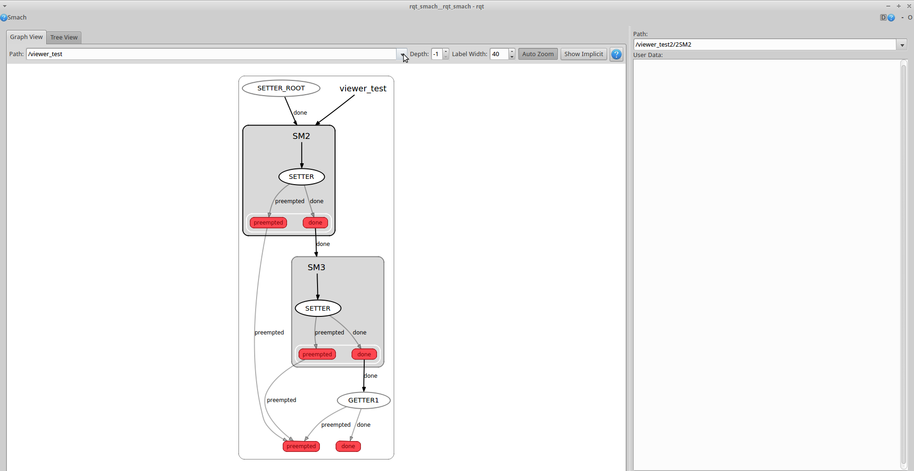

When you hover over a node of the graph, the border color will change  
and the node's path will be shown in the bottom status bar.  

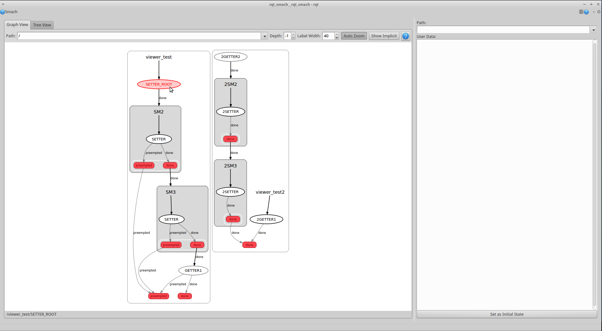

When you click on a node, that node will be selected which means the  
node color will change until you select a different node, and it's  
user data (if any) will be shown in the right hand box.   

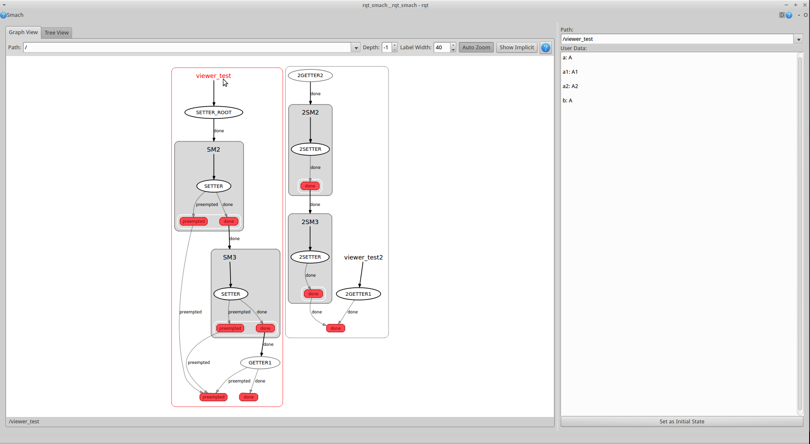

Once a node is selected, you can set it as the initial state of a  
server by using the button in the lower right corner of the window.  
Once this change is made, you can see the server label move to point  
at the new initial state. Initial states are outlined in black rather  
than grey.

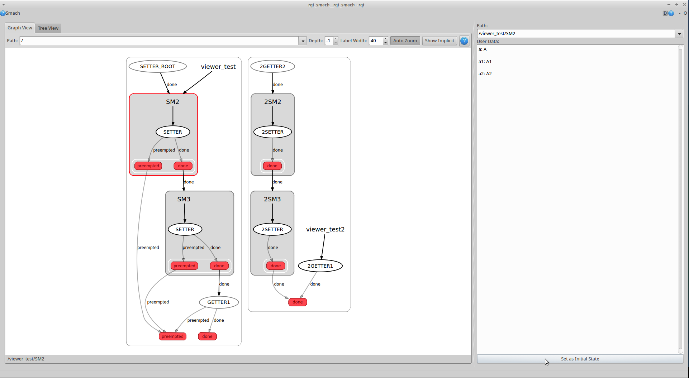

You can use the depth spinner to expand or collapse sub state machines  
and the label width spinner to limit the label width.  

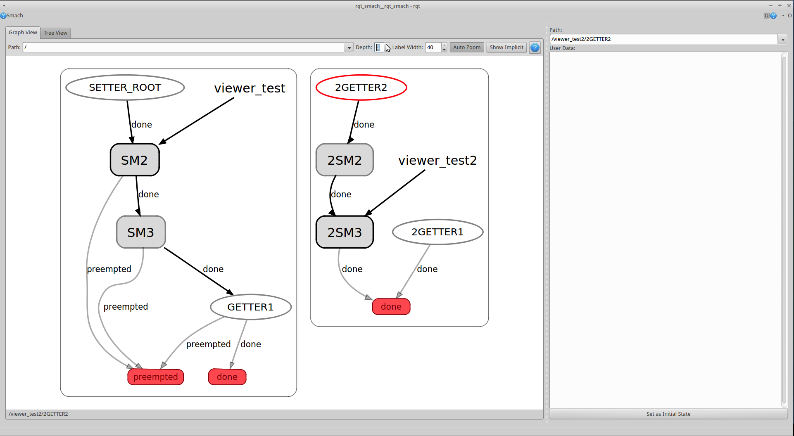

If you selected the Show Implicit button, all transitions will be  
shown.  

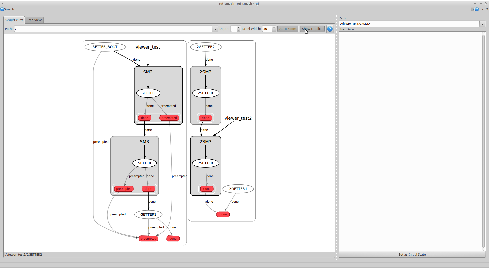

You can zoom and pan the graph using keyboard shortcuts explained when  
you press the'?' button.  

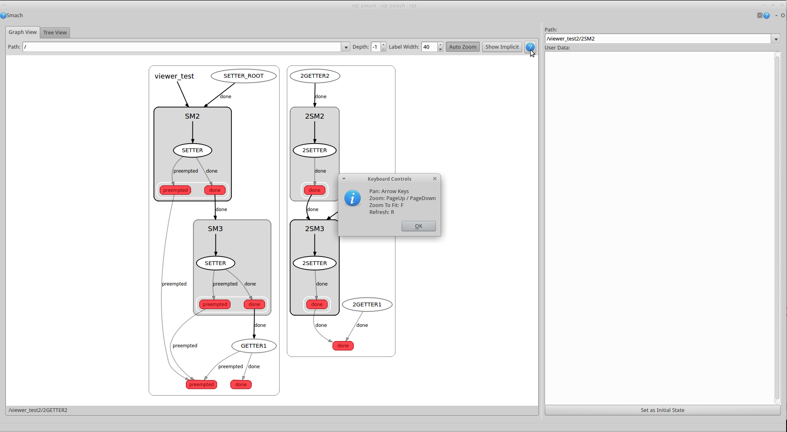

With Auto Zoom set, when you select a different path of the graph to  
view, it will automatically zoom to fit.  

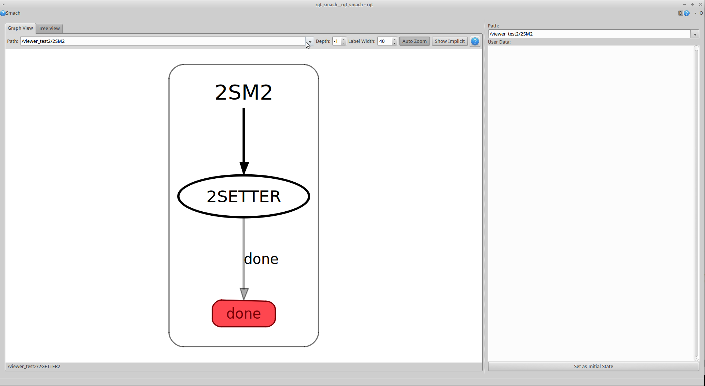

However you can disable that feature by deselecting that button.  

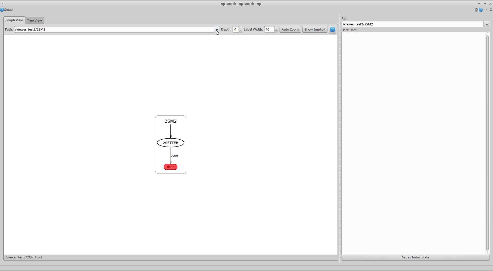

Rqt_smach also comes with a tree view which you can use to view the  
state machine structure.  

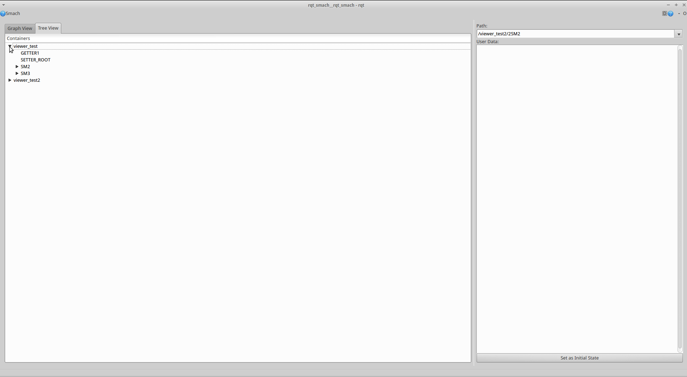

With the tree view you are also able to select nodes, view their user  
data, and set them as the initial state.  

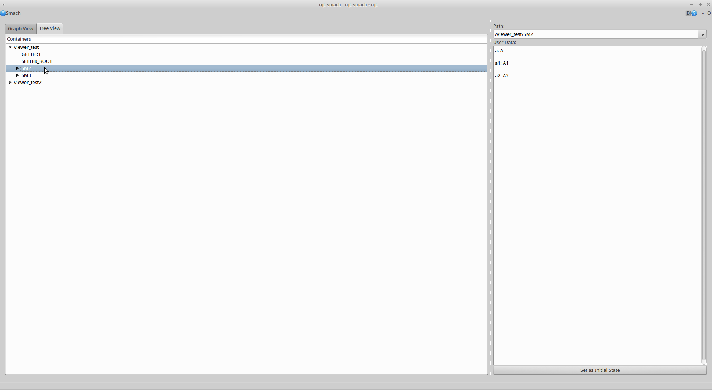

When a state machine is running, the color of the nodes reflect which  
states are currently active.  

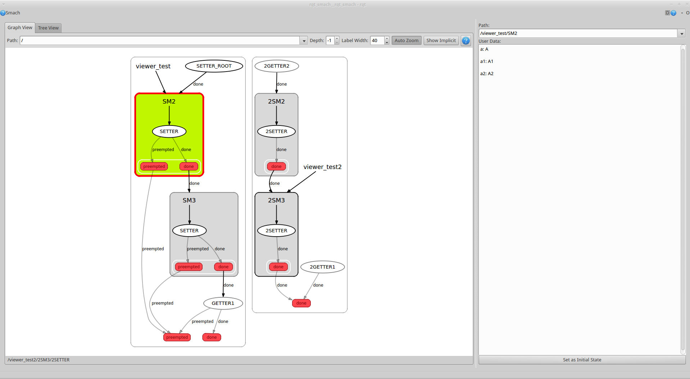

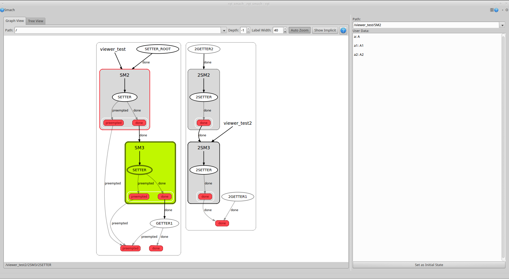

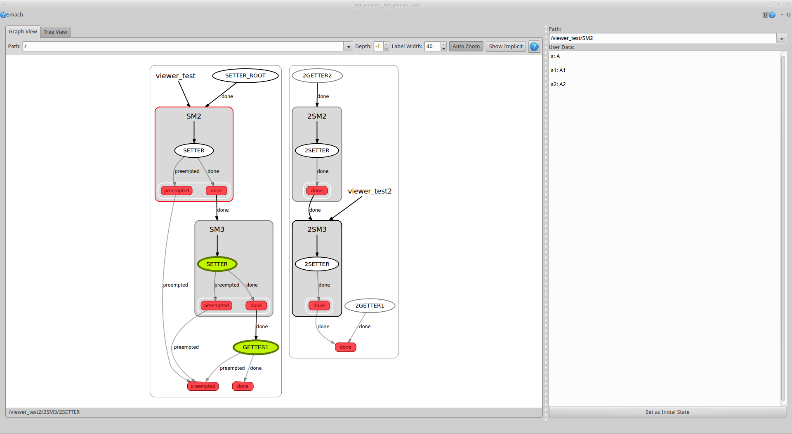
